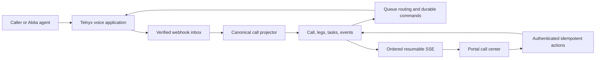

# Call Center Platform Specification

Status: Canonical production runtime

Last reviewed: 2026-07-15

## Decision

`acuity_site` has one call-center implementation for every practice, location,
queue, phone number, and user. An enabled, configured queue is live. There is no
`LEGACY`, `SHADOW`, or `ACTIVE` queue mode, no activation preflight, and no
runtime feature flag that selects a second implementation.

Customer differences are data:

- `CallCenterNumber` maps a practice phone number to an inbound queue and
  controls whether it may be used for outbound caller ID.
- `CallCenterQueue` owns ring, wait, overflow, and voicemail policy.
- `CallCenterQueueMember` authorizes users to receive a queue's calls.
- `CallCenterEndpoint` binds one provider calling identity to one portal user.
- `CallCenterAgentSession` represents one user's current browser connection and
  readiness.

The application remains a modular monolith: Next.js, Postgres, Telnyx, and one
ordered SSE stream. Provider callbacks and commands are durable database work;
the browser is never the source of call truth.

## Runtime



Inbound calls ring every eligible ready browser in deterministic order. A user
remains `AVAILABLE` while a call is only offered. `Take` atomically claims the
call, answers the exact browser media leg, and the user becomes `BUSY` only
after authoritative answer or bridge state. Hangup releases the user.

Outbound calls create the canonical call and customer leg first, then dispatch
one durable provider command. Internal transfer targets a user, resolves that
user's ready endpoint transactionally, and preserves the original customer leg
until the target bridges.

Direct handoff uses:

```text
abita_agent -> authenticated Acuity handoff API -> one-time SIP route
            -> Telnyx callback -> configured queue -> ready browser endpoints
```

The public phone-number hop is not required for direct handoff. The handoff API
selects the configured Acuity number and queue; the SIP URI is provider ingress,
not a browser endpoint.

## Source of truth

- `CallCenterCall`: one logical inbound or outbound call and terminal outcome.
- `CallCenterCallLeg`: one customer or agent provider leg.
- `CallCenterCommand`: one retryable provider effect with one idempotency key.
- `ProviderWebhookEvent`: one verified, deduplicated provider callback.
- `CallCenterEvent`: append-only audit and realtime revision.
- `CallCenterTask`: one missed-call, voicemail, note, callback, or follow-up item.
- `CallCenterVoicemail`: one recording attached to one call.
- `CallCenterAgentSession`: one browser lease, presence, offer, and active call.

`effectOwner` remains only as an immutable compatibility fence for provider
sessions admitted before this cleanup. Every newly configured call is
canonical. It is not an activation switch and is not exposed to configuration
or the portal.

## Invariants

1. One user owns at most one enabled provider endpoint and one live browser
   session.
2. `AVAILABLE` requires a fresh lease, ready provider connection, microphone,
   and browser audio.
3. Ringing does not make a user `BUSY`; confirmed answer or bridge does.
4. One call has at most one winning agent leg; losing legs are canceled.
5. Customer answer is not staff answer.
6. A call cannot enter voicemail while a live agent leg remains.
7. Terminal call and leg states never regress.
8. Provider event IDs and command idempotency keys are unique and replay-safe.
9. All command authorization is practice, location, queue, user, session, and
   call scoped.
10. Realtime state is ordered and resumable; browser media observations never
    independently change logical call state.
11. Logs contain IDs and categorical errors, not patient data, credentials, or
    raw provider payloads.
12. Provider callbacks and commands are processed immediately and failures remain
    visible for operator diagnosis.

## Schema cleanup

Migration `20260715110000_canonical_call_center_note_kind` adds the task shape in
its own PostgreSQL transaction. Migration
`20260715120000_canonical_call_center_cleanup` then preserves historical
sessions, missed calls, voicemail recordings, and notes as canonical calls,
events, tasks, and voicemail rows before removing the retired tables and enums.
Duplicate legacy session legs collapse into one call; duplicate recordings are
preserved on separate historical calls.

The portal reads only canonical tables. The removed legacy APIs, profile
branches, station selector, polling workspace, shadow shell, migration report,
bootstrap, recovery report, and activation preflight have no runtime path.

## Configuration and secrets

There are no rollout environment variables or call-center cron secret. Provider
credentials, the direct-handoff service credential/SIP destination, and database
connectivity remain operational secrets. Queue, number, membership, endpoint,
and caller-ID behavior belongs in Postgres.

## Verification contract

For each configured number, prove inbound ring, Take/bridge, duplicate Take,
browser refresh/reconnect, hangup/release, no-ready voicemail, outbound dial,
internal transfer, direct handoff where configured, and terminal history/task
state. Duplicate and out-of-order provider fixtures must converge without a
second provider effect.
