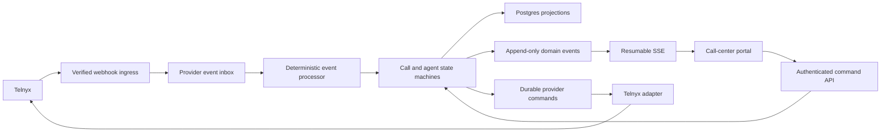

# Call Center Platform Architecture Specification

Status: Active phased migration

Last reviewed: 2026-07-13

Scope: `acuity_site` call-center schema, backend, provider integration, APIs,
realtime delivery, and portal frontend.

## Executive Decision

Build one queue-driven call-center platform for every practice, location, phone
number, and staff account.

Differences between call centers must be data:

- which inbound numbers route to which queue;
- which users belong to a queue;
- which provider calling profile belongs to each user;
- how long a queue rings before voicemail;
- which outbound caller IDs are allowed; and
- which locations a queue represents.

Differences must not be implemented with practice names, user emails, location
names, phone-number constants, or profile-specific query branches.

The platform remains a modular monolith inside `acuity_site`. Postgres is the
source of truth. Telnyx is a replaceable infrastructure adapter. HTTP commands
carry user intent. Verified provider events confirm telephony effects. One
append-only domain event stream supports audit, recovery, and realtime portal
updates without making the system event sourced.

This is an incremental replacement, not a flag-day rewrite.

## Current Implementation Status

The detailed rollout ledger is
[`CALL_CENTER_ROLLOUT_STATUS.md`](./CALL_CENTER_ROLLOUT_STATUS.md). As of July
12, 2026:

- Phases 0-3 are deployed: trusted ingress, durable provider events, generic
  configuration, endpoint leases, and passive canonical calls are in place.
- PR #111 integrated the Phase 4A command foundation and Phase 5A realtime
  frontend foundation into `main` with provider effects disabled.
- PR #112 added the immutable call-owner schema, and production migration run
  `29203472713` applied it successfully.
- PR #113 made one owner durable for every Telnyx session before either legacy
  or canonical effects may run. It is merged, deployed, and green.
- PR #114 added active-call deadlines, durable command dependencies, and the
  recovery scan index. Production Migrations run `29205313102` applied it
  successfully before the application cutover.
- Legacy remains the live owner while Phase 4B/5B is completed for every
  configured queue and phone number.
- The remaining cutover is deployed default-off, activated only after one
  automated preflight, and controlled by one global activation/rollback switch.
  `SHADOW` and the aggregate recovery report remain optional diagnostics, not
  mandatory rollout stages.
- PR #118 adds separate ringing-offer occupancy and binds each durable provider
  profile to at most one practice user. PR #119 makes canonical sessions,
  credentials, Take, outbound calls, and transfers resolve that profile from
  the authenticated user; the canonical portal no longer asks a user to select
  a station. Both changes remain default-off until their migration and
  activation gates pass.

The current Abita handoff still uses the public-number path:

```text
Abita caller -> Acuity phone number -> Acuity queue -> browser SIP leg -> bridge
```

The API-mediated SIP-ingress replacement is now implemented default-off in
Phase 7 at the end of this specification. It cannot be activated until the
provider contract canary and migration-first rollout gates pass.

## Why This Work Exists

The current implementation has correct pieces but no single call-center model:

- the repaired legacy path now rings ready stations automatically, but routing,
  queue state, and recovery still depend on legacy projections;
- account behavior is selected by hard-coded emails, numbers, locations, and
  queue keys in `lib/call-center-profiles.ts`;
- call lifecycle is split across session, queue, ring-attempt, missed-call,
  voicemail, note, and JSON metadata records;
- later provider events can overwrite more accurate terminal state;
- session metadata preserves only the latest provider payload instead of a
  durable event history;
- browser presence can say `AVAILABLE` before the WebRTC client is actually
  ready;
- live UI updates poll aggregate state and refresh the route rather than apply
  ordered domain events;
- one `Take` interaction can issue several HTTP commands while route refreshes
  and browser media notifications independently change presentation state; and
- `lib/call-center.ts` and `SoftphonePanel.tsx` combine domain rules, provider
  transport, persistence, authorization, orchestration, and presentation.

The result is duplicated logic, hidden state transitions, weak recovery, and
customer-visible behavior that differs by account.

## Goals

1. Give every call center identical inbound, outbound, transfer, voicemail,
   history, follow-up, and agent-readiness behavior.
2. Ring every eligible ready endpoint automatically before voicemail.
3. Make duplicate, delayed, and out-of-order provider events safe.
4. Make every call and provider command recoverable after process failure.
5. Keep one authoritative record for each logical fact.
6. Make queue access and routing database-configured and tenant-scoped.
7. Give the frontend a resumable ordered stream instead of full-page refreshes.
8. Keep provider-specific types and behavior outside the domain layer.
9. Remove more code than the new design requires once migration is complete.

## Non-Goals

- Building a general workflow engine or routing-rule language.
- Introducing microservices, Kafka, Redis, or a separate realtime service.
- Replacing Telnyx during this project.
- Building workforce forecasting, quality management, or contact-center CRM.
- Supporting arbitrary routing strategies before a real customer needs them.
- Rewriting analytics unrelated to call-center operations.
- Treating the domain event stream as an event-sourced database.

## First Principles

### One owner per fact

- `PracticeCallCenterSettings` owns practice-level provider configuration.
- `Call` owns logical call state and final outcome.
- `CallLeg` owns one provider telephony leg.
- `CallCenterEndpoint` owns one user's durable provider calling profile.
- `CallCenterAgentSession` owns current staff readiness.
- `CallCenterQueue` owns routing and voicemail policy.
- `CallCenterNumber` owns number-to-queue assignment.
- `CallCenterTask` owns actionable follow-up state.
- `CallCenterEvent` owns the immutable audit and realtime revision.
- `ProviderWebhookEvent` owns webhook receipt and processing state.
- `CallCenterCommand` owns provider side-effect intent and retry state.
- `Call.effectOwner` owns the immutable choice between legacy and canonical
  provider effects for that call.

No other table or JSON field may independently represent those facts.

Queue mode chooses `Call.effectOwner` only when a configured inbound call is
admitted. The webhook transaction records the call and customer leg before any
projector runs. Every later callback resolves the stored owner by exact leg or
provider session; changing queue mode never transfers an in-flight call between
owners. Missing or contradictory trusted identity fails closed.

For calls outside canonical configuration, the first durable Telnyx event owns
the same decision by provider session. That event is assigned before legacy
effects run, so a later configuration change cannot move the in-flight session
to canonical ownership. Canonical projection cannot claim an event until its
main effect lane is terminal.

### Provider effects are asynchronous facts

Sending a provider command does not prove the command happened. A command moves
through `PENDING`, `SENT`, `CONFIRMED`, or `FAILED`. A verified provider event
confirms ringing, answer, bridge, recording, and hangup.

### The browser is not authoritative

The browser may request an action and render state. It never decides which call
won, whether another agent answered, whether voicemail started, or whether a
transfer completed.

### Recovery is normal behavior

Webhook duplication, browser refresh, process termination, network timeout, and
provider delay are expected states. Each has a deterministic recovery path.

### Configuration replaces profiles

There is one routing engine and one authorization path. Customer-specific data
is seeded into queues, numbers, memberships, endpoints, and locations.

## Required Invariants

1. A call cannot enter voicemail while any live agent leg exists.
2. A call cannot enter voicemail until all eligible routing attempts have
   ended, unless queue policy explicitly has no eligible endpoints.
3. `AVAILABLE` requires a fresh heartbeat, provider connection state `READY`,
   microphone readiness, and audio readiness.
4. One user has at most one live agent session, and one provider profile belongs
   to at most one user in a practice.
5. One call has at most one winning agent leg.
6. The first bridged agent leg wins atomically; losing legs are canceled.
7. Call and leg terminal states never move backward.
8. A provider event ID is processed at most once.
9. A server-issued provider command idempotency key represents exactly one
   intended effect.
10. Customer-leg answer is not staff answer. A call is staff-handled only after
    an agent leg bridges.
11. Every call reaches one terminal outcome or appears in a visible recovery
    queue.
12. Every realtime event is tenant-scoped, ordered, and resumable by revision.
13. No authorization decision depends on an email address, display name, or
    phone-number literal.
14. Logs contain internal IDs and categorical error codes, not caller phone
    numbers, patient data, credentials, provider tokens, or raw payloads.
15. One user action keeps one idempotency key through retries, remounts, and
    network ambiguity.
16. Repeating a key for the same command returns the original receipt; reusing
    it for another target returns a conflict.
17. Browser media notifications never independently change logical queue or
    call state.
18. Browser media correlates through call, leg, endpoint, and provider IDs, not
    a caller phone number.
19. A pending command remains visible until an authoritative event or snapshot
    reports success or failure.

## Target Architecture



### Deployment shape

- One Next.js application.
- One Postgres database.
- One provider adapter.
- One database-backed worker lane for provider events, provider commands, and
  expired-call reconciliation. Next.js `after` wakes immediate post-response
  processing; a recovery invocation drains durable leftovers.
- One authenticated SSE connection per active portal tab.
- WebRTC remains the media path between Telnyx and the browser.

The webhook request performs signature verification and a durable inbox insert,
then returns success promptly. Telnyx documents that webhooks may be delivered
more than once, recommends event-ID deduplication, recommends `command_id` for
command idempotency, and recommends quick 2xx acknowledgement followed by
asynchronous processing:

- https://developers.telnyx.com/docs/voice/programmable-voice/voice-api-webhooks
- https://developers.telnyx.com/docs/voice/programmable-voice/command-retries

Next.js `after` runs work after the response while keeping the serverless
invocation alive within its configured duration:

- https://nextjs.org/docs/app/api-reference/functions/after

## Domain Model

### `PracticeCallCenterSettings`

Keep the existing practice-owned settings row, but narrow its responsibility.

Fields:

- `practiceId` unique;
- `enabled`;
- `provider`;
- `providerConnectionId`;
- `defaultOutboundNumberId` nullable;
- `recordingEnabled` default;
- `createdAt` and `updatedAt`.

Remove:

- singular `inboundPhoneNumber`;
- voicemail routing policy;
- number-specific caller ID behavior; and
- fallback logic that mixes database and environment configuration.

Environment variables may seed settings, but runtime behavior reads one
resolved database configuration.

### `CallCenterQueue`

Owns routing behavior.

Fields:

- `id`;
- `practiceId`;
- `name`;
- `enabled`;
- `ringTimeoutSec`;
- `maxWaitSec`;
- `wrapUpSec`;
- `voicemailEnabled`;
- `voicemailGreeting`;
- `overflowQueueId` nullable;
- timestamps.

Initial routing is parallel ringing. Do not add a strategy enum until another
strategy is required. Parallel ringing matches current product intent and the
existing first-bridge-wins behavior.

`overflowQueueId` must reference a queue in the same practice and may not form a
cycle.

A queue with no `CallCenterQueueLocation` rows is practice-wide. Only a portal
membership with all-location access may read or occupy it. Selected-location
members require an explicit queue-location row, and calls are scoped through
the assigned practice number's location rather than `queueId` alone.

Require `0 < ringTimeoutSec <= maxWaitSec`. Wrap-up may be zero; all other
timeouts are positive and bounded by application constants.

### `CallCenterQueueLocation`

Many-to-many relationship between queues and practice locations.

This replaces location-name matching and permits one shared queue to serve
multiple locations without pretending the queue is itself a location.

Fields:

- `queueId`;
- `locationId`;
- unique `(queueId, locationId)`.

### `CallCenterNumber`

Owns phone-number behavior.

Fields:

- `id`;
- `practiceId`;
- `practicePhoneNumberId` unique;
- `providerNumberId` nullable;
- `inboundQueueId` nullable;
- `inboundEnabled`;
- `outboundEnabled`;
- `enabled`;
- timestamps.

`PracticePhoneNumber.phoneNumber` remains the canonical normalized E.164 value.
No phone number is duplicated on this row.

A number with inbound enabled must have an enabled queue. Outbound authorization
uses these rows instead of profile-specific allowlists.

### `CallCenterQueueMember`

Owns queue authorization.

Fields:

- `id`;
- `queueId`;
- `userId`;
- `role`: `AGENT` or `SUPERVISOR`;
- `enabled`;
- timestamps;
- unique `(queueId, userId)`.

Practice membership remains the outer tenant boundary. Queue membership grants
call-center access within that practice. Location access is checked against the
queue's configured locations.

Every operator uses an individual user account. Shared logins are not a routing
or readiness primitive.

### `CallCenterEndpoint`

Represents the durable Telnyx credential and SIP identity for one agent. The
database name remains `CallCenterEndpoint` during the additive migration, but
the canonical product concept is an agent calling profile, not a selectable
station.

Fields:

- `id`;
- `practiceId`;
- `userId` nullable only while an existing profile remains on `LEGACY`;
- `locationId` nullable;
- `label`;
- `providerCredentialId`;
- `sipUsername`;
- `enabled`;
- timestamps.

Provider credentials are per endpoint. Production browsers receive short-lived
JWTs generated by the backend; long-lived login/password fallback is removed.
Telnyx recommends backend-generated JWT authentication and waiting for
`telnyx.ready` before placing calls:

- https://developers.telnyx.com/development/webrtc/js-sdk/tutorials/make-your-first-call

Credential and SIP fields may be null while a profile is disabled. Every
enabled profile used by a `SHADOW` or `ACTIVE` queue requires a user, provider
credential, SIP username, enabled `AGENT` membership, and compatible location.
Unique `(practiceId, userId)` prevents two profiles from being assigned to one
operator. Canonical activation fails closed while any enabled route is
incomplete.

During migration, a backfilled endpoint keeps the legacy seat ID as its endpoint
ID. This preserves provider-leg and operational correlation without a second
identifier mapping table.

### `CallCenterAgentSession`

Represents one authenticated user connected in one browser. The server resolves
the user's calling profile; the browser never chooses or submits an endpoint.

Fields:

- `id`;
- `practiceId`;
- `userId`;
- `endpointId`;
- `clientInstanceId` on the canonical wire, stored in the transitional
  `browserSessionId` database column;
- `presence`: `AVAILABLE`, `PAUSED`, `BUSY`, `WRAP_UP`, or `OFFLINE`;
- `connectionState`: `CONNECTING`, `READY`, `ERROR`, or `CLOSED`;
- `microphoneReady`;
- `audioReady`;
- `offeredCallId` nullable, for a ringing/connecting offer that has not bridged;
- `currentCallId` nullable;
- `readyAt` nullable;
- `lastHeartbeatAt`;
- `leaseExpiresAt`;
- `stateVersion`, a nonnegative monotonic integer;
- timestamps.

Eligibility requires:

- enabled `AGENT` queue membership;
- `presence = AVAILABLE`;
- `connectionState = READY`;
- microphone and audio ready;
- fresh heartbeat;
- unexpired agent-session lease;
- no offered or current call; and
- assigned calling profile enabled.

Use the deployed partial unique index over active session states. Acquisition
locks the authenticated user, closes any expired session for that user, and
claims the assigned profile in one transaction. A second browser receives a
conflict. The database constraints are the correctness mechanism; the recovery
worker is only a fallback.

### `Call`

Represents one logical patient interaction.

Fields:

- `id`;
- `practiceId`;
- `queueId` nullable for outbound calls;
- `numberId`;
- `direction`: `INBOUND` or `OUTBOUND`;
- `status`;
- `fromPhone` and `toPhone` normalized;
- `callerName` nullable;
- `providerCallSessionId` nullable;
- `winningLegId` nullable;
- `stateVersion` integer;
- `receivedAt`;
- `queuedAt` nullable;
- `firstRingAt` nullable;
- `answeredAt` nullable;
- `voicemailStartedAt` nullable;
- `endedAt` nullable;
- `createdAt` and `updatedAt`.

Statuses:

```text
RECEIVED -> QUEUED -> RINGING -> CONNECTED -> WRAP_UP -> COMPLETED
                       |             |
                       |             +-> FAILED
                       +-> VOICEMAIL
                       +-> ABANDONED
                       +-> FAILED
```

Terminal statuses are `COMPLETED`, `VOICEMAIL`, `ABANDONED`, and `FAILED`.
`WRAP_UP` means telephony ended successfully but a configured disposition
window is still open.

Transition code is the only code allowed to update status or terminal
timestamps.

### `CallLeg`

Represents one provider leg. It replaces `CallCenterRingAttempt`.

Fields:

- `id`;
- `callId`;
- `kind`: `CUSTOMER` or `AGENT`;
- `endpointId` nullable;
- `agentSessionId` nullable;
- `providerCallControlId` unique nullable;
- `providerCallLegId` unique nullable;
- `providerCallSessionId` nullable;
- `status`: `CREATED`, `DIALING`, `RINGING`, `ANSWERED`, `BRIDGED`, `ENDED`, or
  `FAILED`;
- `attemptNumber`;
- `startedAt`;
- `answeredAt` nullable;
- `bridgedAt` nullable;
- `endedAt` nullable;
- `hangupCauseCode` nullable;
- `errorCode` nullable;
- timestamps.

Do not store raw provider exception text as a queryable hangup cause. Map it to
a bounded internal code and keep restricted detail on the provider event.

Per-leg transitions are monotonic. Call status is derived from authoritative
leg facts and queue deadlines, so a late webhook cannot downgrade the call.

### `CallCenterVoicemail`

Represents a voicemail recording attached to a call.

Target fields after canonical cutover:

- `id`;
- `callId` unique;
- `providerRecordingId` unique;
- `durationSec`;
- `storageKey` nullable;
- `providerReadyAt` nullable;
- `listenedAt` nullable;
- timestamps.

The deployed `CallCenterVoicemail` is transitional: it still carries legacy
practice, location, session, missed-call, caller, and recording URL fields and
links to the canonical call through nullable unique `callCenterCallId`. Preserve
it until authorized recording storage and the Phase 6B migration are proven.

Do not persist a public recording URL as durable state. Either copy the asset to
controlled object storage or fetch a short-lived provider URL behind the
existing authorized proxy.

### `CallCenterTask`

Represents work that still needs a person.

Fields:

- `id`;
- `practiceId`;
- `callId` nullable;
- `sourceEventRevision`, referencing `CallCenterEvent.revision`;
- `callerPhone` normalized nullable;
- `kind`: `MISSED_CALL`, `VOICEMAIL`, `CALLBACK`, or `FOLLOW_UP`;
- `status`: `OPEN` or `RESOLVED`;
- `assignedToUserId` nullable;
- `resolvedByUserId` nullable;
- `resolvedAt` nullable;
- `dedupeKey`;
- timestamps.

Unique `(practiceId, dedupeKey)`.

For call-derived work, `callId` is required and caller phone is read from the
call. For standalone work, `callId` is null and `callerPhone` is required. A
task does not copy a call's phone number.

Missed calls are not copied into another call table. A call ends as
`ABANDONED`; policy may create an `OPEN` task. A voicemail is an artifact plus
an optional task. Notes and dispositions are domain events. An explicit
callback or follow-up note creates a task.

The UI may group open tasks by normalized phone number, but grouping is a
projection, not persisted duplicate state.

### `ProviderWebhookEvent`

Durable inbox for provider delivery.

Fields:

- `id`;
- `provider`;
- `providerEventId` unique;
- `eventType`;
- `occurredAt` nullable;
- `receivedAt`;
- `processingStatus`: `RECEIVED`, `PROCESSING`, `PROCESSED`, `IGNORED`, or
  `FAILED`;
- `attemptCount`;
- `nextAttemptAt` nullable;
- `errorCode` nullable;
- `payload` restricted JSON;
- `processedAt` nullable;
- `canonicalProjectionStatus`, independent from legacy `processingStatus`;
- `canonicalProjectionAttemptCount`;
- `canonicalProjectionNextAttemptAt` nullable;
- `canonicalProjectionErrorCode` nullable and limited to 100 characters;
- `canonicalProjectedAt` nullable;
- timestamps.

The legacy processor and canonical projector have separate checkpoints. During
the passive-projection phase, legacy processing remains the only provider-effect
owner. Canonical projection may retry or fail without replaying legacy effects.
Both checkpoints use the provider-processing state vocabulary, but neither
checkpoint advances the other.

After successful durable legacy processing, Next.js schedules one
failure-contained canonical attempt after the provider response. This keeps the
normal projection path out of the minute-level recovery cadence. The scheduled
callback receives only the inbox event ID, never invokes the legacy projector,
and cannot change the provider acknowledgement. The cron remains the bounded
recovery owner for failed, stale, or unscheduled canonical work.

The checkpoint migration initializes historical events as `IGNORED` because
their retained payload may already be redacted. Events received after the
migration begin at `RECEIVED` and are eligible for passive projection.

Raw payload access is restricted and retained only as long as operations and
compliance require. Application logs receive only event ID, type, internal call
ID, processing status, and categorical error code.

The retention worker may redact a payload only after both checkpoints are
terminal (`PROCESSED`, `IGNORED`, or an exhausted `FAILED`). When passive
projection is intentionally disabled through the retention deadline, redaction
atomically marks its checkpoint `IGNORED`; a later rollout must not resurrect
that event. This prevents both indefinite raw retention and deletion of input
still required by an enabled canonical worker.

### `CallCenterCommand`

Durable provider side-effect intent.

Fields:

- `id`;
- `practiceId`;
- `callId`;
- `legId` nullable;
- `type`;
- `idempotencyKey`;
- `status`: `PENDING`, `SENDING`, `SENT`, `CONFIRMED`, or `FAILED`;
- `attemptCount`;
- `nextAttemptAt` nullable;
- `errorCode` nullable;
- `arguments` restricted JSON;
- timestamps.

Unique `(practiceId, type, idempotencyKey)`. Provider commands use stable keys
derived from the intended effect, such as one dial command for one call leg.
The internal command ID is sent as the provider `command_id`.

HTTP operation idempotency is separate. A successful user operation records a
domain event with the request's `Idempotency-Key` in the same transaction as its
state change and provider-command creation. A retry for the same target returns
that operation receipt; reuse for another target returns `409`.

Examples are answer customer leg, start ringback, dial agent leg, stop playback,
hang up losing leg, start voicemail greeting, and start recording.

The dispatcher uses the command ID as Telnyx `command_id`. A timeout or 5xx is
retryable with the same ID. A validation or authorization error is terminal.
Browser-local WebRTC media actions such as answer, mute, hold, DTMF, and hangup
are not server Call Control commands; provider events still confirm their
telephony outcome.

### `CallCenterEvent`

One append-only domain event stream for audit and realtime delivery.

Fields:

- `revision` big integer primary key;
- `practiceId`;
- `aggregateType`: `CALL`, `AGENT_SESSION`, `TASK`, or `CONFIGURATION`;
- `aggregateId`;
- `type`;
- `occurredAt`;
- `actorUserId` nullable;
- `idempotencyKey` nullable;
- `data` minimal tenant-authorized JSON;
- timestamps.

Projection updates and event inserts occur in the same transaction. The table
is not used to rebuild the entire database. It provides:

- a durable audit trail;
- ordered tenant-scoped realtime changes;
- SSE resume after a known revision; and
- evidence for incident review.

No separate outbox table is needed because this table is itself the committed
stream read by the portal.

The database may retain authorized note or disposition content in an event, but
never raw provider payloads or credentials. The SSE serializer emits only the
safe projection required for the current user's queue scope. Revisions are
serialized as decimal strings so JavaScript does not lose 64-bit precision.

User-issued domain commands use unique `(practiceId, type, idempotencyKey)` when
an idempotency key is present. This prevents duplicate dispositions, task
resolution, and other non-provider mutations without adding another operation
table.

## State Transition Rules

### Event processing

For each provider event:

1. Claim one `RECEIVED` or retryable `FAILED` inbox row with a database lock.
2. Resolve the call and leg using provider identifiers and command linkage.
3. Lock the affected call row.
4. Apply monotonic leg transitions.
5. Recompute the legal call transition from current legs and deadlines.
6. Persist projection changes.
7. Append sanitized domain events.
8. Enqueue any provider commands in the same transaction.
9. Mark the inbox event processed.

If processing fails, roll back domain changes and mark the inbox event with a
categorical error in a separate failure update.

### First bridge wins

When an agent leg bridges:

1. Lock the call.
2. If `winningLegId` is null, set it to this leg and move the call to
   `CONNECTED`.
3. If `winningLegId` already names another leg, this leg lost.
4. Enqueue hangup commands for every non-winning live agent leg.
5. Stop caller ringback.

This decision is database-atomic. The browser and provider do not elect the
winner.

### Terminal precedence

Terminal status is selected from facts, not last webhook arrival:

1. A winning bridged agent leg that ended normally produces `WRAP_UP` or
   `COMPLETED`.
2. A started voicemail flow produces `VOICEMAIL` unless an agent had already
   won.
3. Caller hangup before staff bridge or voicemail produces `ABANDONED`.
4. An unrecoverable provider or configuration failure produces `FAILED`.

Once terminal, later events may enrich legs, recording details, or audit data,
but may not replace terminal status.

## Routing Algorithm

### Inbound call

1. Resolve the called E.164 number to one enabled `CallCenterNumber`.
2. Resolve its enabled inbound queue.
3. Create the logical call and customer leg idempotently.
4. Answer the customer leg and start bounded ringback.
5. Select eligible agent sessions from enabled `AGENT` queue membership and
   endpoint readiness.
6. Create one agent leg and dial command for each eligible endpoint.
7. Move the call to `RINGING` after at least one dial command is accepted.
8. Let the first bridge win atomically.
9. At ring timeout, stop or cancel remaining attempts.
10. If an overflow queue exists, repeat once per acyclic queue hop.
11. Otherwise start voicemail if enabled.
12. If voicemail is disabled, end as `ABANDONED` and create a missed-call task.

The initial engine rings all eligible sessions in parallel. Selection order is
stable for deterministic tests, but order does not alter parallel behavior.

### No eligible agent

Do not fabricate ringing. Append `call.routing_no_eligible_agent`, preserve the
reason counts, and follow overflow or voicemail policy immediately.

Reason categories include:

- no queue members;
- no live agent sessions;
- endpoint lease expired;
- provider connection not ready;
- all agents busy or paused; and
- endpoint configuration invalid.

### Manual claim

Manual `Take` remains a recovery operation. It may dial one explicitly selected
eligible endpoint if the call is still queued or ringing and has no winner.

### Outbound call

1. Authorize the user through practice and queue membership.
2. Validate the selected caller ID through `CallCenterNumber.outboundEnabled`.
3. Create an idempotent outbound call intent.
4. Return the call ID and signed client state to the checked-in browser.
5. The browser starts the WebRTC call with that call ID in trusted client state.
6. Provider events attach provider identifiers and drive ringing, answer, and
   final state.

This keeps media on the browser WebRTC connection while making the outbound
intent, caller ID, tenant, and final outcome server-owned.

### Transfer

An internal transfer creates a new agent leg on the same logical call. The
source leg stays bridged until the target leg bridges. On success, target
becomes the winning active leg and source ends. On timeout, target ends and the
source continues. A blind transfer may explicitly end the source, but that is a
different command and UI confirmation.

The portal submits a target user, never a station or SIP identity. In the same
transaction, the server locks and resolves that user's configured calling
profile and current ready session, verifies queue/location membership, and
creates the replacement leg. Self-transfer, missing configuration, mismatched
session ownership, or stale readiness fails before provider I/O.

## Deadline and Recovery Worker

Use Postgres as the durable work queue. A short-lived worker invocation claims
small batches using row locks and skips rows already owned by another worker.
Postgres explicitly supports `SKIP LOCKED` for multiple consumers of a
queue-like table:

- https://www.postgresql.org/docs/current/sql-select.html

Worker lanes:

- provider events ready for processing;
- provider commands ready for send or retry;
- calls whose ring, queue, wrap-up, or voicemail deadline expired;
- expired agent-session leases; and
- failed items eligible for bounded retry.

Webhook ingress schedules `after(() => processProviderEvent(eventId))`
immediately after the durable insert, then returns 2xx. The configured function
duration must cover normal event processing. Correctness does not depend on the
post-response callback finishing: the inbox row and any created command rows
remain claimable by the recovery invocation. Recovery processing is also
triggered by later webhook traffic and a scheduled sweep.

Every work item has bounded exponential backoff, a maximum attempt count, and a
visible terminal failure. There is no infinite retry.

## API Contract

All portal APIs require an authenticated practice context. Every query and
command re-resolves queue access on the server. Client-supplied practice IDs,
queue memberships, caller IDs, and endpoint ownership are never trusted.

### Snapshot

`GET /api/portal/call-center/snapshot?queueId=<id>&clientInstanceId=<id>`

Returns:

- a global event high-water revision read consistently with the projections;
- visible queue configuration;
- the current user's agent session and assigned calling profile readiness;
- other configured agent users eligible for an internal transfer;
- active and waiting calls;
- recent terminal calls;
- open tasks; and
- operational counts.

Until Phase 4A creates durable user-operation receipts, `operations` is `null`,
not an empty success projection. Provider commands are infrastructure effects
and are not presented as user operations.

This is the only initial live-workspace read.

### Realtime stream

`GET /api/portal/call-center/events?after=<revision>`

The stream emits authorized `CallCenterEvent` rows in revision order.

During the Phase 5A shadow interval, canonical consumers must also send
`contract=canonical&queueId=<id>&clientInstanceId=<id>`. Omitting that explicit discriminator keeps
the existing refresh stream unchanged. Remove the temporary discriminator only
when the canonical frontend becomes the queue owner in Phase 5B.

SSE messages use:

- `id` as the revision;
- `event` as one stable `projection` type;
- `data` as the sanitized projection delta; and
- heartbeat comments to keep the connection alive.

An authorized `cursor` event carries only the last fully scanned global
revision. It lets bounded reconnects advance across batches containing only
other queues' events without exposing those events. A batch cursor is emitted
only after the full batch has been scanned and queued for delivery.

If the requested revision is older than retained events, return a reset event
that tells the client to fetch a fresh snapshot. Native EventSource reconnects
automatically, and SSE event IDs support resuming from the last delivered event:

- https://developer.mozilla.org/en-US/docs/Web/API/Server-sent_events/Using_server-sent_events

SSE is preferred over WebSocket because realtime application data is
server-to-browser only; browser commands remain authenticated HTTP requests and
media already uses WebRTC.

Snapshot and stream bind the local session projection to the supplied canonical
`clientInstanceId`; another tab's lease is never selected. The snapshot exposes
queue `routingMode`, which is the only persisted frontend/backend ownership
switch. Domain delta types remain inside projection data. Filtered revisions
advance through `cursor` without clearing or mutating visible state.

`revision` is a global delivery cursor, not a tenant-local counter. Tenant and
queue filtering therefore creates expected numeric gaps. Clients accept any
strictly increasing authorized revision, ignore revisions at or below their
cursor, and use aggregate `stateVersion` to reject stale deltas. A reset is
required only when the cursor predates retained history or a delta cannot be
applied safely.

### Agent session commands

- `POST /api/portal/call-center/agent-sessions`
  - connect the authenticated user in this browser;
  - resolve and acquire that user's calling profile server-side;
  - return the agent-session ID and lease state without provider credentials.
- `PATCH /api/portal/call-center/agent-sessions/:id`
  - heartbeat presence and provider connection state.
- `DELETE /api/portal/call-center/agent-sessions/:id`
  - check out and release the lease.

The server accepts `connectionState = READY` only after the frontend receives
the provider-ready event. PATCH requires the last acknowledged `stateVersion`
and rejects stale updates, so delayed ready notifications cannot overwrite a
newer failure. Lease expiry still handles abrupt browser loss.
The lease is 60 seconds. Acquisition locks the authenticated user row, closes
expired live sessions for that user, and commits the session and sanitized
event together. It does not mint
provider credentials. Phase 5B must add a separate session-bound credential
endpoint before canonical media becomes active; this preserves the session ID
and an immediate release path if the provider call fails. Same-user, same-client
live acquisition returns the existing session without a mutation or duplicate
event; heartbeat PATCH owns lease renewal. A fresh different-client lease
returns `409`. The client ID is session-storage-only, and a browser
`BroadcastChannel` claim regenerates copied new-tab identities before POST. The
wire serializer maps database `ERROR` and `CLOSED` connection states to `FAILED`
and `DISCONNECTED`.

### Call commands

- `POST /api/portal/call-center/calls`
  - originate an outbound call.
- `POST /api/portal/call-center/calls/:id/claim`
  - manual recovery take.
- `POST /api/portal/call-center/calls/:id/transfer`
  - attended or explicitly confirmed blind transfer.
- `POST /api/portal/call-center/calls/:id/disposition`
  - finish wrap-up and optionally create a task or note event.

Call and task mutations require an `Idempotency-Key` header. Agent heartbeats
are naturally idempotent by session ID and do not. Successful responses return
the logical call ID, operation-event revision, durable provider-command ID when
applicable, and current state version. They acknowledge durable intent, not
completion of an asynchronous provider effect.

### Task commands

- `GET /api/portal/call-center/tasks`
- `POST /api/portal/call-center/tasks/:id/resolve`
- `POST /api/portal/call-center/tasks/:id/assign`

### History

- `GET /api/portal/call-center/calls`
- `GET /api/portal/call-center/calls/:id`
- `GET /api/portal/call-center/callers/:phone`

History is cursor-paginated and read from canonical calls, legs, events,
voicemails, and tasks. The live snapshot does not carry the full history.

### Webhook

`POST /api/telnyx/webhooks`

Responsibilities are limited to:

1. read the raw request;
2. verify the Ed25519 signature and timestamp tolerance;
3. validate the minimal envelope;
4. insert `ProviderWebhookEvent` using provider event ID uniqueness;
5. schedule immediate post-response processing for that durable event; and
6. return a 2xx acknowledgement.

No routing, provider calls, voicemail control, or large portal query runs before
the webhook response.

## Backend Module Boundaries

```text
lib/call-center/
  domain/
    call-state.ts
    leg-state.ts
    agent-state.ts
    routing.ts
    transitions.ts
    errors.ts
  application/
    commands.ts
    process-provider-event.ts
    reconcile-deadlines.ts
    queries.ts
    tasks.ts
  infrastructure/
    provider.ts
    telnyx-provider.ts
    event-inbox.ts
    command-dispatcher.ts
    event-stream.ts
  auth/
    queue-access.ts
```

Rules:

- `domain` is pure and imports no Prisma, Next.js, Telnyx, React, or environment
  variables.
- `application` owns transactions and invokes domain functions.
- `infrastructure` translates provider and storage contracts.
- route handlers parse input, call one application operation, and serialize the
  result.
- authorization is reusable and queue-based.
- there is no customer-profile module.

## Frontend Architecture

### Component shape

```text
app/portal/app/call-center/
  CallCenterShell.tsx
  call-center-reducer.ts
  use-agent-session.ts
  use-call-center-stream.ts
  use-softphone.ts
  use-call-commands.ts
  QueuePanel.tsx
  IncomingCallPanel.tsx
  ActiveCallPanel.tsx
  Dialer.tsx
  WrapUpPanel.tsx
  FollowUpPanel.tsx
  HistoryPanel.tsx
```

One reducer owns the snapshot and applies versioned domain-event deltas. Do not
add a state-management library until React primitives are proven insufficient.

`useSoftphone` owns only WebRTC lifecycle and media controls. It reports
provider readiness and media notifications upward. It does not own queue state,
task state, call winner selection, history, or routing. Media legs bind through
internal call, leg, endpoint, and provider identifiers; caller-phone matching is
not an allowed correlation path.

An accepted `Take` or transfer remains visibly `Connecting` until a canonical
event or replacement snapshot reports the intended leg `BRIDGED` and the call
`CONNECTED`, or the durable operation `FAILED`. Request completion, component
remount, and browser media notification do not clear that state.

### Readiness UX

The portal shows one truthful readiness checklist:

- calling profile configured for the authenticated user;
- agent session acquired;
- provider connected;
- microphone allowed;
- sound enabled; and
- presence available.

The user is not shown as available until all required conditions pass. Failure
states name the broken boundary and offer one recovery action.

### Incoming calls

- Eligible ready endpoints ring automatically.
- The incoming-call surface is prominent and persistent.
- Audio unlock is an explicit setup step, not a silent best effort.
- Browser notification is optional secondary signaling.
- Answer and decline act on the provider media leg; backend webhook state
  confirms the outcome.
- Another agent winning immediately removes the losing ring surface through the
  event stream.

### Live updates

1. Fetch one snapshot.
2. Open the SSE stream after the snapshot revision.
3. Apply authorized events with `revision > currentRevision`; numeric gaps are
   expected after tenant and queue filtering.
4. Ignore duplicate or older revisions and stale aggregate versions.
5. Fetch a new snapshot only when the cursor is outside retention or a delta
   cannot be applied safely.
6. Reconnect with `Last-Event-ID` from the last applied global revision.

Do not use `router.refresh()` for live call state.

### Workspace information architecture

- Top: readiness, selected queue, active operational counts.
- Primary: incoming/active call and live queue.
- Secondary: open follow-up tasks.
- Tertiary: compact recent history with links to full history.
- Right-side or focused panel: caller timeline and post-call wrap-up.

The same shell renders every call center. Location and queue selectors come from
authorized configuration.

## Security and Privacy

- Verify every provider webhook signature.
- Use short-lived WebRTC JWTs minted by the backend.
- Never return provider credential IDs unless the browser needs an opaque
  endpoint reference.
- Scope every call, event, task, queue, endpoint, number, and recording query by
  authenticated practice.
- Recheck queue membership on every command.
- Proxy voicemail access through authorization.
- Keep raw provider payloads restricted and retention-bounded.
- Sanitize logs before serialization, not by convention at each call site.
- Use internal call, leg, command, and event IDs for correlation.
- Audit check-in, presence change, claim, transfer, disposition, task resolution,
  and configuration changes.

## Observability

### Structured correlation

Every log and metric may include:

- practice ID;
- queue ID;
- call ID;
- leg ID;
- provider event ID;
- command ID;
- endpoint ID;
- categorical state or error code; and
- latency.

It may not include caller phone, caller name, transcript, recording URL,
credential, token, or raw provider payload.

### Required metrics

- webhook acknowledgement latency;
- provider event processing lag and failure count;
- provider command attempt and failure count;
- inbound calls by queue and outcome;
- received-to-first-ring latency;
- ring-to-answer latency;
- calls with no eligible agent and reason;
- active calls with expired deadlines;
- voicemail start and recording-save success;
- agent-session readiness and lease expiry;
- SSE connections, reconnects, gaps, and resets; and
- open follow-up task age.

### Alerts

- unprocessed provider event older than one minute;
- failed event or command above retry limit;
- inbound call without first ring or terminal routing by `maxWaitSec`;
- call stuck nonterminal after provider hangup;
- voicemail started without recording or terminal resolution after its deadline;
- provider webhook signature failures above baseline;
- zero ready endpoints during configured staffed hours, if hours are later added;
  and
- sustained SSE reset or gap rate.

## Failure Recovery Matrix

| Failure                                       | Required behavior                                                                           |
| --------------------------------------------- | ------------------------------------------------------------------------------------------- |
| Duplicate webhook                             | Unique provider event ID returns success without reapplying effects.                        |
| Out-of-order webhook                          | Monotonic leg transitions and call recomputation prevent downgrade.                         |
| Web process exits after inbox insert          | Worker claims and processes the durable event.                                              |
| Provider command times out                    | Retry the same idempotency key; do not create another intent.                               |
| Process exits after provider accepted command | Provider webhook or command reconciliation confirms the existing command.                   |
| Browser closes                                | Endpoint lease expires; agent becomes ineligible; live call follows provider hangup events. |
| Browser SSE disconnects                       | Reconnect after last revision; snapshot on retention gap.                                   |
| No eligible agent                             | Record reason and follow overflow or voicemail policy immediately.                          |
| Agent answers after another wins              | Atomic winner rejects the late leg and hangs it up.                                         |
| Voicemail playback event is lost              | Deadline reconciler advances the pending voicemail flow.                                    |
| Recording callback is lost                    | Reconciler queries by provider recording/call ID before marking failure.                    |
| Configuration points across tenants           | Transaction rejects it; foreign keys and application checks enforce practice ownership.     |

## Testing Strategy

### Pure domain tests

- every legal call and leg transition;
- every illegal backward transition;
- duplicate and permuted event sequences produce the same final state;
- first-bridge-wins concurrency decisions;
- queue eligibility by membership, readiness, lease, and current call;
- overflow cycle rejection;
- terminal precedence; and
- task creation and deduplication.

Property tests should permute duplicate and out-of-order event fixtures around
answer, bridge, hangup, playback, and recording events.

### Integration tests

- webhook signature, inbox deduplication, and prompt acknowledgement;
- database transaction updates projection plus domain event plus command;
- concurrent bridge events elect one winner;
- command retry reuses one provider command ID;
- deadline worker advances abandoned, voicemail, and wrap-up calls;
- queue and location authorization;
- session-bound endpoint token issuance without a hidden committed lease; and
- voicemail authorization.

### Provider contract tests

Keep sanitized fixtures for every Telnyx event used by the adapter. Contract
tests verify parsing without leaking provider payload shapes into domain tests.

### Browser tests

- check in and become ready only after provider-ready signal;
- automatic incoming ring;
- answer, decline, hangup, mute, hold, DTMF, and transfer;
- another agent wins while this agent is ringing;
- sound and microphone permission failures;
- page refresh and SSE reconnect during idle, ringing, and active calls;
- duplicate Take and transfer clicks, concurrent tabs, request retry, component
  remount, stale response, and reconnect while `Connecting`;
- provider callback correlation when `command_id` is absent;
- post-call disposition and task creation; and
- tenant, queue, and location scoping.

### Synthetic production test

After global activation, run controlled internal inbound calls to every
configured phone number. Verify:

- event ingestion;
- first ring;
- agent answer and bridge;
- losing-leg cancellation when two test endpoints are enabled;
- voicemail fallback when no endpoint answers;
- recording availability; and
- final canonical outcome.

Use test identities so synthetic calls never enter patient reporting or
follow-up queues.

## Performance and Reliability Targets

- Webhook durable acknowledgement p95 below 500 ms.
- Durable event processing lag p95 below one second.
- Inbound received-to-first-ring p95 below two seconds when an eligible endpoint
  exists.
- 100% of calls terminal or visible in recovery within one minute of their final
  provider event or configured deadline.
- Zero known terminal-state downgrades.
- Zero calls sent to voicemail while a live agent leg exists.
- Zero duplicate provider commands for one idempotency key.
- Realtime UI convergence within two seconds under normal operation.
- Load test at two times observed peak concurrency, with a minimum target of 100
  simultaneous calls before general rollout.

## Migration Plan

### Phase 0: Repair current production behavior

Before structural migration:

1. Auto-ring every eligible ready endpoint through the same shared path for all
   current call-center profiles.
2. Gate `AVAILABLE` on provider-ready state.
3. Add monotonic terminal-status handling.
4. Sanitize webhook logging.
5. Add focused tests for inbound auto-ring, winner bridge, and voicemail fallback.

This is the incident fix and remains independently deployable.

### Phase 1: Add durable provider boundaries

1. Add `ProviderWebhookEvent` and `CallCenterCommand`.
2. Change webhook ingress to verify, persist, and acknowledge.
3. Process existing behavior through the durable inbox.
4. Add bounded retry and recovery visibility.
5. Keep current call-center tables as projections during this phase.

Gate: duplicate and out-of-order fixtures pass; production event backlog remains
empty under normal traffic.

### Phase 2A: Discover legacy configuration without writes

1. Read existing settings and profile constants and emit a redacted proposed
   queue, number, location, member, and endpoint mapping.
   Current practice members observed on a legacy seat are deterministic
   membership evidence for that seat's proposed queue; former or cross-practice
   users are excluded.
2. Preserve each deployed legacy seat ID as its proposed endpoint ID so legacy
   correlation is not lost.
3. Report missing, conflicting, cross-tenant, and ambiguous mappings; make no
   writes and stop if any generic configuration already exists.
4. Expose the same deterministic report through a protected admin endpoint.

Gate: every ambiguity is explicitly reviewed and the report remains
deterministic and mutation-free.

### Phase 2B: Add protected generic configuration

1. Add queues, queue locations, numbers, queue members, and endpoints from a
   reviewed Phase 2A report. Preserve each legacy seat ID as the endpoint ID.
2. Apply one tenant-scoped snapshot in a transaction guarded by a strong ETag
   and `If-Match`. An enabled queue, number, endpoint, or queue membership must
   be explicitly disabled before omission; omitted disabled rows remain present.
3. Treat endpoint credential and SIP identities as write-only. Reads expose
   only configured booleans, and audit events contain counts and versions.
4. Refuse `ACTIVE`, incomplete `SHADOW`, cross-tenant references, invalid
   inbound or outbound routes, enabled inbound numbers whose phone-number
   location is outside the queue locations, duplicate identities, and overflow
   cycles.
5. Emit `CONFIGURATION_UPDATED` in the configuration transaction. Legacy
   routing remains the sole live effect owner.
6. Require a `READY_FOR_MANUAL_REVIEW` Phase 2A report before the first generic
   configuration write. Once generic rows exist, later edits use the protected
   snapshot contract rather than re-running the bootstrap gate.
7. Compare the validated canonical version while the practice lock is held. An
   identical replay returns the locked snapshot/version without another write
   or audit event; a successful change returns that transaction's exact
   snapshot/version without a post-commit reread.
8. The one-time production bootstrap uses the exact SHA-256 version of the
   reviewed redacted report. A guarded `main` workflow rebuilds the secret-bearing
   snapshot inside the production boundary, refuses report drift and partial or
   different generic configuration, applies `LEGACY` only, and logs no
   credentials or caller data. An exact committed replay is a locked no-op. The
   audit stores the original and triggering GitHub actors plus run ID and attempt.

Gate: protected configuration is deterministic under replay and concurrency,
and the reviewed snapshot remains `LEGACY` until decision-only shadow exists.

### Phase 2C: Add endpoint leases

1. Add atomic browser-session leases for canonical endpoints.
2. Make same-browser check-in idempotent, reject a different live browser, and
   reclaim only expired leases.
3. Keep lease acquisition credential-free. Phase 5B issues provider credentials
   through a separate session-bound endpoint after the lease commits.

Gate: concurrent check-in, expiry, reconnect, and loser demotion are
deterministic without changing the legacy routing owner.

### Phase 3: Add canonical call model

1. Add `Call`, `CallLeg`, `CallCenterTask`, and `CallCenterEvent`.
2. Claim and complete the independent canonical projection checkpoint; never
   reuse or mutate the legacy processing checkpoint for projection recovery.
3. Process each durable event through the legacy projector as the sole effect
   owner and add a passive canonical projection from the same event. Canonical
   code issues no provider effects.
   The passive lane consumes only call lifecycle facts, resolves generic
   numbers, queues, and endpoints only when exactly one tenant-scoped mapping
   exists, and writes the call, leg, revisioned event, and checkpoint completion
   in one database transaction. Unsupported facts become `IGNORED`; incomplete
   or ambiguous mappings fail with bounded categorical retries.
   Generic `call.recording.saved` events are not voicemail evidence; only an
   explicit voicemail-completed fact may refine a call to `VOICEMAIL`.
   Exact stored provider leg identity is resolved before interpreting later
   events that omit `client_state`; phone direction is never used to guess an
   agent leg. Earlier or richer facts may only move call/leg start timestamps
   earlier and fill missing caller identity or phone fields. Persisted bridge,
   voicemail, and terminal timestamps are reconciled on every fact, so a call
   with bridge evidence cannot converge to `VOICEMAIL` in any delivery order.
4. Backfill historical calls where mapping is unambiguous.
5. Report and isolate ambiguous historical rows; do not invent missing state.
6. Run invariant audits continuously.

Gate: fresh-call canonical outcomes match provider facts and no invariant audit
fails for a full observation window.

### Temporary compatibility bridge

Through Phase 4A, legacy routing and projectors remain the sole effect owner and
canonical state is a passive observer. There is no canonical-to-legacy bridge in
this interval. Only when a queue activates canonical routing in Phase 4B may one
compatibility bridge write the minimum legacy read projection needed for
rollback. It runs from the durable processor, never issues provider commands or
applies profile routing, and every write and mismatch is measured.

Before Phase 4B, ingress persists that ownership decision on the call. `LEGACY`
and `SHADOW` admissions store `LEGACY`; `ACTIVE` admissions store `CANONICAL`.
The provider inbox records the same owner before canonical projection becomes
claimable, so asynchronous projection cannot create a second effect owner.

### Phase 4A: Build canonical routing and commands

1. Keep decision-only `SHADOW` available as an optional diagnostic mode.
2. Add idempotent claim, transfer, outbound, and routing commands.
3. Keep canonical provider-command production disabled until the Phase 5A
   frontend is complete and the automated activation preflight passes.

The first Phase 4A foundation is deliberately effect-free. A pure decision
function evaluates enabled membership, endpoint scope and credentials, the
current endpoint lease, provider readiness, microphone/audio readiness,
presence, and current-call ownership in stable endpoint/session order. For a
`SHADOW` queue it records one immutable `CALL_ROUTING_SHADOW_DECIDED` event per
call under the call lock. `LEGACY` and `ACTIVE` queues never execute the decision
function, and the shadow boundary has no command or provider adapter.

HTTP operation idempotency is a separate reusable transaction primitive. It
serializes `(practiceId, operationType, Idempotency-Key)`, binds the key to a
server-derived target fingerprint, runs the state mutation and any durable
command inserts through the caller's same transaction, and appends the receipt
last. An exact replay returns the original revision; reuse for a different call,
endpoint, transfer target, or arguments returns `409`. This foundation does not
yet expose claim, transfer, or outbound APIs and does not dispatch commands.

The shadow receipt attempt after passive projection is failure-contained so it
cannot invalidate an already committed projection. The recovery cron scans at
most five oldest inbound, non-terminal `SHADOW` calls without a decision,
records them through the same call lock, and reports the remaining gap. Inline
and recovered receipts are labeled separately because recovery-time readiness
is useful evidence but is not equivalent to the original routing-time snapshot.
Queue-mode changes and terminal-call races skip without writing.

The provider-command lane is default-off. It claims only commands whose call has
the immutable `CANONICAL` effect owner, commits `SENDING` before network I/O,
sends the database command ID as Telnyx `command_id`, and retries the same row
with bounded categorical failures. Provider addresses and credentials are
resolved at claim time and never persisted in command arguments. Canonical call,
leg, and endpoint IDs travel in `client_state`; the verified webhook confirms
the exact command and a later sender completion cannot regress `CONFIRMED` to
`SENT`. Missing `command_id` falls back only to one exact command on the resolved
canonical leg; ambiguity fails visibly. One default-off switch,
`CALL_CENTER_CANONICAL_ACTIVATION_ENABLED`, owns new canonical admissions and
frontend ownership for every configured queue and phone number. The command
executor always drains rows already authorized by an immutable `CANONICAL`
owner so rollback cannot strand in-flight calls.

The first canonical user-operation vertical is manual claim. Authenticated
`POST /api/portal/call-center/calls/:id/claim` accepts only the canonical browser
identity, acknowledged session version, and `Idempotency-Key`; it resolves the
user's profile server-side. In one transaction it locks the operation key,
call, and agent session; revalidates
queue access and `AGENT` membership; requires an eligible canonical-owned call and an
unwon inbound queued/ringing call; reuses any existing live same-session leg;
or reserves the session, creates one agent leg and one `DIAL_AGENT` command, and
appends the operation receipt last. The command stores only canonical IDs and a
bounded purpose. It never stores credentials, SIP addresses, or provider call
controls. Before dispatch, the persistence boundary locks the call, queue, and
command; revalidates `ACTIVE` ownership, current AGENT membership, location
scope, endpoint readiness, and the session reservation; and terminally rejects
invalid intent without provider I/O. Terminal rejection, a losing leg, or an
ended winner releases only the reservation-owned `BUSY` state and preserves an
agent's explicit pause. Snapshot and SSE expose every accepted receipt and its
current command state. This route performs no provider I/O. After the transaction
returns, the route may wake the exact committed command through Next.js
`after()`; scheduling and callback failures are contained because the same row
remains claimable by bounded recovery. Immediate and recovery paths share one
dispatcher composition. Until the coordinated cutover is installed, protected
configuration still rejects `ACTIVE` and command dispatch remains disabled.

Gate: each user operation produces one receipt and each intended provider effect
produces one durable command under retry and concurrency.

### Phase 5A: Build the canonical realtime frontend

1. Add snapshot and revisioned SSE APIs.
2. Introduce the reducer-based shell and readiness flow.
3. Run old and new UI against the same canonical projections during testing.
4. Keep the new UI inactive until command, reconnect, and media-correlation
   tests pass. `SHADOW` may be used for diagnosis but is not a release gate.

### Phases 4B and 5B: Cut over routing and frontend together

1. Complete canonical routing and frontend ownership for every enabled queue
   and configured phone number, then deploy the whole cutover default-off.
2. Run one automated preflight that verifies the production migration,
   configuration coverage, command/event health, callback correlation, and at
   least one ready test endpoint.
3. Activate canonical routing and frontend ownership together for all
   configured queues and phone numbers through one global switch.
4. Run controlled live calls against every number and verify synthetic and real
   aggregate outcomes.
5. Keep one global rollback switch that sends new admissions to `LEGACY` and
   rejects new canonical user operations. Calls already admitted retain their
   durable owner, workspace/media ownership, and required lifecycle command
   drain until terminal state.
6. Remove route-refresh live behavior after the global observation window.

Gate: first-ring latency, answer rate, voicemail rate, provider failures,
realtime convergence, duplicate-command rate, and state invariants remain
within agreed thresholds.

### Phase 6A: Delete legacy application code

After all queues use the canonical model:

- delete `lib/call-center-profiles.ts`;
- delete practice/email/phone/location special cases from actions and queries;
- delete manual-profile outbound allowlists;
- delete legacy `CallCenterQueueItem` and `CallCenterRingAttempt` writes;
- replace `CallCenterMissedCall` with call outcomes and tasks;
- replace durable note rows with note/disposition events and tasks;
- delete legacy session status writes after history reads canonical calls;
- split and remove the legacy orchestration portions of `lib/call-center.ts`;
- reduce `SoftphonePanel.tsx` to the media hook and focused presentation
  components; and
- remove compatibility flags, dual writes, and reconciliation code.

Phase 6A requires canonical live, history, voicemail, task, and caller views;
zero direct provider effects outside the dispatcher; no nonterminal legacy-only
calls; zero bridge mismatches and invariant failures for the observation window;
and a rehearsed queue rollback. Keep the legacy tables read-only for at least
one full release window and prove zero runtime reads and writes.

### Phase 6B: Drop legacy schema

Use a separate SQL-only contract migration after Phase 6A evidence is complete
and rollback no longer depends on legacy state. Preserve required audit evidence,
migrate the hybrid voicemail projection, then drop legacy tables, columns,
indexes, and compatibility flags.

Deletion is part of completion, not optional cleanup.

## Rollback

- Use one global admission/frontend switch for the coordinated cutover; the
  immutable call owner remains the per-call rollback boundary.
- Keep legacy projections readable until canonical history and follow-up are
  verified.
- Do not roll back schema migrations destructively; disable canonical routing
  and continue durable event capture.
- A routing rollback rejects new canonical user operations but continues
  required lifecycle work and committed commands for calls already owned by
  `CANONICAL`. It does not discard inbox events, canonical calls, or audit
  history.
- Reconciliation must be able to close calls created before a flag change.

## First-Principles Review

### Why a modular monolith?

The domain, database, auth, portal, and provider integration already deploy
together. Splitting them would add network failure and distributed transaction
problems without removing a present bottleneck. Module boundaries and durable
tables provide the needed separation.

Decision: keep one application and one database.

### Why not full event sourcing?

The system needs immutable evidence and ordered realtime delivery, but most
queries need current calls, tasks, and agent readiness. Rebuilding those from an
event log would increase code and operational risk.

Decision: authoritative projections plus one transactional append-only event
stream.

### Why both provider events and domain events?

Provider events are untrusted external delivery records with provider payloads,
retry state, and signature context. Domain events are sanitized internal facts
used for audit and UI updates. Combining them would leak provider semantics and
PHI into the domain stream.

Decision: keep both; they own different facts.

### Why both calling profiles and agent sessions?

A calling profile is durable provider configuration assigned one-to-one to a
practice user. An agent session is that user's ephemeral browser readiness.
Combining durable credentials with live readiness caused false availability;
letting the browser choose the credential made identity and concurrency
ambiguous.

Decision: keep the internal provider profile separate from readiness, bind it to
the authenticated user, and resolve it only on the server.

### Why both calls and legs?

A patient interaction can have a customer leg, several simultaneous agent legs,
and transfer legs. Provider leg state is not logical call outcome.

Decision: one logical call with many provider legs; delete the separate ring
attempt model.

### Why no missed-call table?

`ABANDONED` is already a call outcome. Copying it into another table creates
reconciliation problems. The actual additional fact is whether staff still need
to act.

Decision: call outcome plus a follow-up task.

### Why no note table?

Notes and dispositions are immutable timeline facts. Only unresolved work needs
mutable state.

Decision: record notes/dispositions as domain events; create tasks only when
action is required.

### Why Postgres-backed work instead of an external queue?

The inbox, commands, projections, and events must commit consistently. Postgres
already owns that transaction. Current scale does not justify another durable
system.

Decision: database-backed workers with small locked batches and bounded retry.

### Why SSE instead of WebSocket?

Application state flows server to browser. Commands use ordinary authenticated
HTTP. Audio already uses WebRTC. SSE provides automatic reconnect and event IDs
with less protocol and client code.

Decision: one resumable SSE stream per tab.

### Why parallel routing only?

The product currently needs available staff to ring. Round robin, skills,
priority weights, and schedules are plausible but unproven requirements. Adding
them now would create a policy engine before there is policy.

Decision: parallel first; extend only from observed demand. Phase 7 admits the
caller through Acuity's application SIP ingress and then reuses the same queue
policy. Endpoint selection never moves into the source agent.

### Why keep a durable command table?

Provider requests can time out after being accepted. Without durable intent,
the system cannot distinguish retrying the same effect from creating a new one.

Decision: keep commands and use provider idempotency IDs.

### Review result

The design is accepted with these deliberate simplifications:

- one deployable application;
- one database;
- no event sourcing;
- no separate outbox table;
- no external message broker;
- no routing DSL;
- one routing strategy initially;
- no duplicated missed-call projection;
- no mutable note projection;
- no customer profile layer; and
- no frontend state-management dependency.

Every retained model has a distinct owner boundary. Every mutable state has one
writer path. Every external effect has durable intent and durable confirmation.

## Implementation Completion Criteria

The project is complete only when:

- every call center uses database-configured queues and numbers;
- every eligible ready endpoint rings automatically;
- no profile-specific routing or access code remains;
- canonical calls and legs power live queue, history, voicemail, and follow-up;
- provider inbox, commands, deadlines, and retries are operationally visible;
- the frontend uses snapshot plus ordered resumable events;
- live call state performs no route refresh or caller-phone correlation;
- one user operation cannot create duplicate provider effects;
- production synthetic calls verify answer and voicemail paths;
- invariant audits remain clean through the rollout window;
- direct provider effects, old writes, dual reads, feature flags, compatibility
  code, and legacy tables are removed; and
- focused tests, full checks, migration verification, and rollback rehearsal pass.

## Open Decisions Before Implementation

These choices require product or operational confirmation; they do not change
the architecture:

1. Default queue ring timeout and maximum wait.
2. Whether wrap-up requires a disposition or merely offers one.
3. Whether voicemail recordings copy into controlled object storage or remain
   provider-hosted behind an authorized proxy.
4. Retention period for restricted raw provider webhook payloads.
5. Whether current shared call-center users will be split into individual users
   during this migration or afterward.

Everything else in this specification should be implementable without
customer-specific branching.

## Phase 7: API-Mediated Direct SIP Handoff

Status: default-off implementation in progress. Activation remains blocked on
the migration-first rollout, Phases 4B/5B prerequisites, and one Telnyx/LiveKit
contract canary proving that the tokenized Request-URI user reaches the Acuity
SIP ingress webhook.

This phase removes the unnecessary public-phone-number hop from voice-agent
handoffs without giving `abita_agent` ownership of Acuity routing.

### Current and target paths

Current production path:

```text
Abita caller -> Acuity phone number -> Acuity queue -> browser SIP leg -> bridge
```

Rejected shortcut:

```text
abita_agent -> static browser seat SIP URI
```

A static seat URI would bypass Acuity readiness, queue access, atomic claim,
voicemail, failover, reporting, and rollback. It would also make
`abita_agent` choose a call-center endpoint it does not own.

Target path:

```text
abita_agent
  -> authenticated Acuity handoff API
  -> short-lived signed Acuity SIP ingress destination
  -> Acuity validates and consumes the handoff
  -> existing canonical queue routing
  -> ready browser endpoint(s) -> Take -> bridge
```

The SIP target is an Acuity-controlled application ingress, not a public DID
and not a reusable user credential. This removes the 618 phone-number hop while
keeping readiness, queue selection, voicemail, provider commands, and browser
media correlation inside the existing canonical owner.

The first integration is Abita, but the contract is source-neutral. No
customer-specific routing branch belongs in the API or domain model.

### Ownership rules

1. `abita_agent` owns the decision to request a human handoff and the original
   LiveKit call identifier.
2. Acuity resolves the configured number from the original route phone and owns
   queue selection, readiness, endpoint offers, Take, no-answer behavior,
   voicemail, failover, and reporting.
3. The API returns one application SIP URI with an opaque one-time token in its
   user part. It never exposes a reusable user credential or selects a user.
4. A short-lived handoff row owns only the interval between API issuance and
   authenticated SIP ingress. It does not reserve an agent before media exists.
5. The canonical `Call` and `CallLeg` remain the only owners of logical outcome
   and provider-leg state after ingress.
6. Ordinary patient calls continue to use the practice's public numbers. This
   phase changes trusted voice-agent handoffs only.
7. Each service credential is pinned to one practice. The request cannot choose
   or discover another tenant.

### Handoff schema

Add one narrow `CallCenterHandoff` model:

```text
CallCenterHandoff
  id
  practiceId
  queueId
  numberId
  callId?
  sourceSystem
  sourceCallId
  idempotencyKey
  requestFingerprint
  tokenHash
  callerPhone
  status            ISSUED | INGRESS_SEEN | CONNECTED | EXPIRED | FAILED
  providerCallSessionId?
  expiresAt
  ingressSeenAt?
  connectedAt?
  failedAt?
  failureCode?
  createdAt
  updatedAt
```

Required constraints:

- unique `(practiceId, sourceSystem, idempotencyKey)`;
- unique `(sourceSystem, sourceCallId)` so one upstream call cannot be admitted
  into two practices;
- token stored only as a hash and accepted once; the durable webhook inbox also
  redacts the URI token and stores only its hash before persistence;
- `ISSUED` has no provider session or canonical call;
- `INGRESS_SEEN` binds exactly one provider session and canonical call;
- bounded expiry measured in seconds, not an open-ended assignment; and
- categorical failure codes only, with no caller number or provider payload in
  logs.

### API contract

```http
POST /api/internal/call-center/handoffs
Authorization: Bearer <service credential>
Idempotency-Key: <source-scoped stable key>
Content-Type: application/json
```

Request:

```json
{
  "sourceCallId": "livekit-call-id",
  "callerPhone": "+1...",
  "routePhoneNumber": "+1..."
}
```

The authenticated credential fixes `sourceSystem = ABITA` and one configured
practice; callers cannot choose a practice, queue, endpoint, or source name.
`routePhoneNumber` must resolve to exactly one enabled `CallCenterNumber` and
inbound queue inside that practice.

Accepted response:

```json
{
  "type": "DIRECT",
  "handoffId": "handoff-id",
  "sipUri": "sip:acuity-ingress~ah1~<one-time-token>@sip.telnyx.com",
  "expiresAt": "2026-07-10T12:00:30Z",
  "sipHeaders": {
    "X-Acuity-Handoff-Id": "handoff-id",
    "X-Acuity-Handoff-Token": "<one-time-token>"
  }
}
```

`sipHeaders` remains temporarily for the deployed Abita response parser. Acuity
does not read or trust those headers at ingress; only the URI token hash can
consume the reservation.

The API authenticates the source, tenant-scopes through the configured number,
validates the number/queue relationship under locks, and creates the handoff in
one transaction. Repeating the exact live request returns the same token;
changed input or a changed idempotency key for the same source call returns
`409`. Disabled or incomplete configuration fails closed before a REFER.

### Runtime sequence

1. `abita_agent` requests a handoff before moving media.
2. Acuity resolves the existing enabled number and queue, records an `ISSUED`
   handoff, and returns the application SIP URI with its one-time token.
3. `abita_agent` passes the returned URI unchanged to LiveKit
   `transferSipParticipant`. It may also pass the compatibility headers, but
   Acuity does not use them for correlation.
4. Acuity hashes and redacts the token from Telnyx's webhook `to` field before
   persistence, validates and consumes it, and atomically binds
   one provider session, creates the canonical customer call/leg, freezes
   `effectOwner = CANONICAL`, and marks `INGRESS_SEEN`.
5. The existing canonical router offers the call to ready users. Live Queue is
   the only pre-answer UI; `offeredCallId` does not make a user Busy.
6. Take and provider answer/bridge use the existing command and projection
   path. Confirmed connection marks both the session and handoff connected.
7. No-ready behavior, voicemail, failover, hangup, and reporting remain the
   ordinary canonical call lifecycle.

Provider-specific transfer failure semantics must be proven with LiveKit and
Telnyx contract tests before activation. The direct-transfer client disables
LiveKit RPC failover, records REFER as started before awaiting its ambiguous
result, and never changes routes after an ownership conflict. The legacy phone
path keeps its existing retry behavior while direct handoff is unconfigured.

The provider boundary is intentionally limited to documented fields:

- LiveKit accepts a SIP URI as `TransferSIPParticipant.transfer_to`:
  <https://docs.livekit.io/reference/telephony/sip-api/#transfersipparticipant>.
- LiveKit SIP passes that value unchanged into the REFER `Refer-To` header:
  <https://github.com/livekit/sip/blob/d5d1e09bbe826baaae9c335d8f42523192c7ce29/pkg/sip/service.go#L368-L374>
  and
  <https://github.com/livekit/sip/blob/d5d1e09bbe826baaae9c335d8f42523192c7ce29/pkg/sip/protocol.go#L294-L296>.
- Telnyx defines Voice API webhook `to` as the called party number or SIP URI:
  <https://developers.telnyx.com/docs/voice/programmable-voice/voice-api-webhooks>.
- RFC 3261 permits the marker and base64url characters in the SIP URI user part:
  <https://www.rfc-editor.org/rfc/rfc3261.html#section-25.1>.

No custom REFER header is part of the correlation contract.
The 2026-07-13 provider canary showed that arbitrary `X-Acuity-*` REFER headers
did not survive into the destination INVITE or Telnyx webhooks.

### Rollout and rollback

1. Merge and apply the additive handoff migration before behavior code reads it.
2. Deploy the API, ingress binding, and Abita client default-off.
3. Configure one Acuity-controlled Telnyx SIP application URI and enable SIP URI
   calling. Prove the tokenized URI user in the first destination webhook,
   provider IDs, durable token redaction, and invalid-token rejection with one
   canary.
4. Enable one global direct-handoff switch for all configured numbers; do not
   add an optical-only branch or per-user URI.
5. Run answer, no-answer, transfer failure, API timeout, duplicate request,
   expired token, reconnect, voicemail, and rollback synthetic tests.
6. Compare answer rate, first-ring latency, handoff failure rate, voicemail
   rate, duplicate-leg count, and invariant failures with the public-number
   path.

Expired unconsumed issuances are closed by the bounded recovery worker after a
five-minute webhook grace window. Invalid or expired signed ingress is marked
terminal in both inbox lanes rather than becoming a retrying dead letter.

Rollback is one configuration change:
`CALL_CENTER_DIRECT_HANDOFF_ENABLED=false`. This stops new API admissions;
already-issued tokens remain valid for their 30-second lease and already-bound
calls retain immutable canonical ownership. Abita may use its explicitly
enabled pre-REFER phone fallback while the old number path remains available.

### Phase 7 completion gate

Phase 7 is complete only when:

- `abita_agent` contains no static Acuity seat URI or seat-selection logic;
- Acuity is the only owner of queue and endpoint selection;
- duplicate API requests and duplicate SIP ingress cannot create a second leg;
- no-answer, voicemail, failover, and reporting match the canonical queue
  behavior;
- direct-SIP and public-number paths produce the same canonical call outcome;
- global rollback is rehearsed;
- provider evidence proves tokenized URI-user propagation and gateway webhook
  correlation; and
- the 618 public-number hop is removed only after the observation gate closes.
