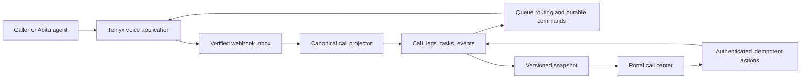

# Call Center Platform Specification

Status: Canonical production runtime

Last reviewed: 2026-07-21

## Decision

`acuity_site` has one call-center implementation for every practice, location,
queue, phone number, and user. An enabled, configured queue is live. There is no
`LEGACY`, `SHADOW`, or `ACTIVE` queue mode, no activation preflight, and no
runtime feature flag that selects a second implementation.

Customer differences are data:

- `CallCenterNumber` maps a practice phone number to an inbound queue and
  controls whether it may be used for outbound caller ID.
- `CallCenterQueue` owns membership, location scope, and voicemail configuration.
- `CallCenterQueueMember` authorizes users to receive a queue's calls.
- `CallCenterEndpoint` binds one provider calling identity to one portal user.
- `CallCenterAgentSession` represents one user's current browser connection and
  readiness.

The application remains a modular monolith: Next.js, Postgres, Telnyx, and one
versioned snapshot. Provider callbacks and commands are durable database work;
the browser is never the source of call truth.

## Runtime



Inbound calls ring every eligible ready browser in deterministic order. A user
remains `AVAILABLE` while a call is only offered. `Answer` accepts the exact
browser media leg and waits for the SDK to report connected media. For inbound
calls, the user becomes `BUSY` only after a provider-confirmed bridge. An
outbound call becomes connected when the remote party answers. Hangup releases
the user.

Starting an outbound call first ends this agent's waiting inbound offers through
durable provider commands. Only after those commands are accepted does the
server create the canonical outbound call and agent leg. The browser then dials
with opaque, server-issued correlation state.

A connected call remains in the authorized Live queue while held. The snapshot
projects `On hold` only from the latest effective durable hold-music command: a
confirmed start establishes hold, and a successfully dispatched stop clears it.
Pending, failed, timed-out, or superseded work never becomes shared hold state.

Direct handoff uses:

```text
abita_agent -> authenticated Acuity handoff API -> one-time SIP route
            -> Telnyx callback -> configured queue -> ready browser endpoints
```

The public phone-number hop is not required for direct handoff. The handoff API
selects the configured Acuity number and queue; the SIP URI is provider ingress,
not a browser endpoint.

## Source of truth

- `CallCenterCall`: one logical inbound or outbound call and terminal outcome.
- `CallCenterCallLeg`: one customer or agent provider leg.
- `CallCenterCommand`: one durable provider effect with one idempotency key.
- `ProviderWebhookEvent`: one verified, deduplicated provider callback with one
  receipt-to-terminal processing lifecycle.
- `CallCenterEvent`: append-only audit revision.
- `CallCenterTask`: one missed-call, voicemail, note, callback, or follow-up item.
- `CallCenterVoicemail`: one recording attached to one call.
- `CallCenterAgentSession`: one browser lease, connection, and readiness state.

The provider-event module owns durable receipt, deduplication, admission,
projection, categorical failure, and committed-command dispatch. Its HTTP
adapter owns signature verification only. Out-of-scope callbacks end as one
auditable `IGNORED` outcome; provider-command delivery remains a separate
durable lifecycle.

## Invariants

1. One user owns at most one enabled provider endpoint and one live browser
   session.
2. `AVAILABLE` requires a fresh lease, ready provider connection, microphone,
   and browser audio.
3. An inbound ring or answer does not make a user `BUSY`; a confirmed bridge
   does. An outbound remote answer is already a connected call.
4. One call has at most one winning agent leg. A cold transfer may replace that
   winner only after the same-location target explicitly answers and bridge
   evidence exists; failure leaves the source winner connected.
5. Customer answer is not staff answer.
6. A call cannot enter voicemail while a live agent leg remains.
7. Terminal call and leg states never regress.
8. Provider event IDs and command idempotency keys are unique and replay-safe.
9. All command authorization is practice, location, queue, user, session, and
   call scoped.
10. Each versioned snapshot is authoritative; browser media observations never
    independently change logical call state.
11. Logs contain IDs and categorical errors, not patient data, credentials, or
    raw provider payloads.
12. Provider commands dispatch immediately and a bounded outbox drain recovers
    interrupted sends; terminal failures remain visible for operator diagnosis.
13. Provider callbacks first serialize by provider session. Direct-handoff
    correlation, when required to resolve the practice, follows; then every
    configuration write, admission, webhook projection, outbound creation, and
    provider-command transition acquires the shared transaction-scoped practice
    lock before row locks. Provider I/O occurs only after the database
    transaction releases that lock.
14. A provider event has one claim lease, attempt count, retry time, categorical
    error, processed time, and status from receipt through terminal outcome.

## Schema cleanup

Migration `20260715110000_canonical_call_center_note_kind` adds the task shape in
its own PostgreSQL transaction. Migration
`20260715120000_canonical_call_center_cleanup` then preserves historical
sessions, missed calls, voicemail recordings, and notes as canonical calls,
events, tasks, and voicemail rows before removing the retired tables and enums.
Duplicate legacy session legs collapse into one call; duplicate recordings are
preserved on separate historical calls.

The portal reads only canonical tables. The removed legacy APIs, profile
branches, station selector, legacy workspace, shadow shell, migration report,
bootstrap, recovery report, and activation preflight have no runtime path.

Migration `20260719180000_remove_call_center_rollback_state` closes the schema
rollback seam after an explicit release-owner confirmation. It removes unused
queue ring/wait/wrap-up/overflow settings, Agent Session offered/current Call
pointers and relations, and `queueDeadlineAt`. `CallCenterCall.deadlineAt`
remains the one lifecycle deadline, and active `CallCenterCallLeg` rows remain
the one occupancy source. The migration refuses to run while any retired live
state exists.

Migration `20260719190000_retire_dual_webhook_lifecycle` closes the provider
session compatibility window. It refuses to run with a nonterminal legacy call,
an unresolved legacy/admission event, or an active event claim; moves the
canonical checkpoint into the retained processing fields; then removes
`effectOwner`, the second status/retry/error/timestamp set, and their indexes.
Historical calls and events remain intact. The release decision combines the
sanitized production/provider evidence with an explicit release-owner
assumption that Telnyx will not automatically or manually redeliver a finalized
Voice webhook more than 72 hours after its final delivery record; Telnyx does
not publish the default Voice retry ceiling.

This migration is forward-only. Application rollback is limited to a revision
that understands the one-lifecycle schema; rollback must not restore the
retired owner fence or dual inbox.

Migration `20260720150000_server_owned_outbound_calls` makes the server the sole
owner of outbound call creation and correlation. The browser receives opaque
provider state only after the canonical call and agent leg exist. A deployment
must not roll back to a browser-owned outbound implementation after this
migration is applied.

## Configuration and secrets

`CRON_SECRET` authenticates the bounded provider-command outbox drain. Provider
credentials, the direct-handoff service credential/SIP destination, and database
connectivity remain operational secrets. Queue, number, membership, endpoint,
and caller-ID behavior belongs in Postgres.

## Verification contract

For each configured number, prove inbound ring, Answer/bridge, concurrent
answers with one bridge winner, browser refresh/reconnect, hangup/release,
no-ready voicemail, outbound dial, same-location cold transfer, direct handoff
where configured, outbox recovery, and terminal history/task state. Duplicate
and out-of-order provider fixtures must converge without a second provider
effect.
